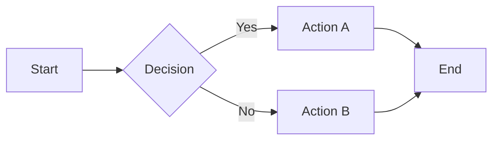
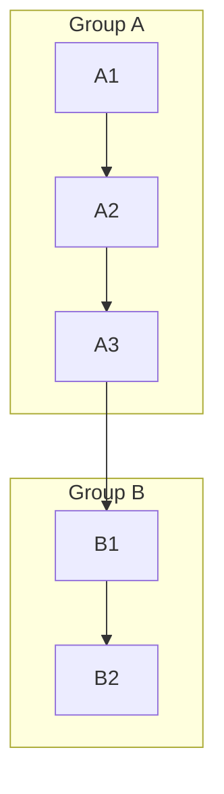
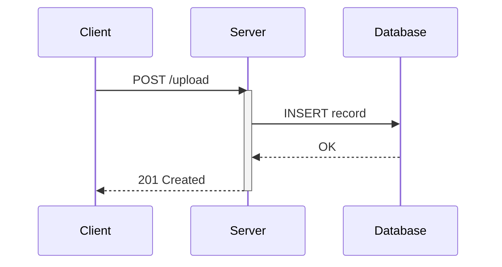
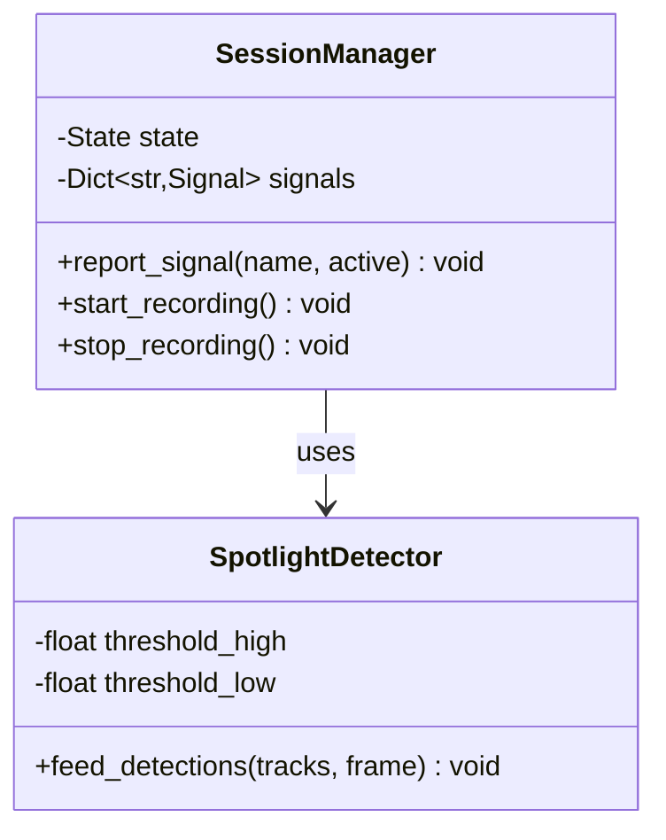

## Obsidian CLI

The Obsidian CLI (`obsidian`) is available. **Prefer the Obsidian CLI over standard file tools** (Read, Edit, Write, Grep, Glob) for vault operations -- it preserves Obsidian metadata, handles wikilinks on rename/move, and keeps the vault's index consistent. Fall back to standard file tools only when the CLI lacks a needed capability (e.g., surgical line-level edits via Edit).

### Targeting this vault

This vault is `tether-vault`, a regular subdirectory of the tether repo (not a git submodule reused across multiple repos). Obsidian resolves `vault=<name>` by the folder basename, so the CLI name is `tether-vault`.

Pass `vault=tether-vault` as the **first** parameter, before the subcommand. A known CLI bug routes commands to the focused vault when `vault=` is not first:

```bash
obsidian vault=tether-vault read file="Note Name"
```

### Prerequisites

The CLI is a remote control for a running Obsidian GUI; it auto-launches Obsidian if not running and does not work headless. Before the first CLI call in a session, verify this vault is registered:

```bash
obsidian vaults verbose 2>&1 | grep -v "^Debug:\|^Gtk-Message:\|ERROR:dbus" | awk '$1=="tether-vault"'
```

If nothing prints, assist the user with registration (next section). If another vault with the same basename prints at a different path, stop -- duplicate names make `vault=` routing ambiguous; ask the user to rename the other vault's folder first.

### Registering this vault (per-user / per-machine)

Vault registration lives in Obsidian's user config, not in the repo, so every clone requires a one-time setup per machine.

Config path by install type:

- Flatpak: `~/.var/app/md.obsidian.Obsidian/config/obsidian/obsidian.json`
- Native: `~/.config/obsidian/obsidian.json`

Programmatic registration:

1. **Fully quit Obsidian first.** `pgrep -x obsidian` must return nothing. For Flatpak, `flatpak kill md.obsidian.Obsidian`. Obsidian rewrites the config on exit and will clobber edits made while it is running -- refuse to edit the JSON until the process is gone.
2. Add an entry to the `vaults` object with a fresh 16-char hex id (`openssl rand -hex 8`) and a current unix-ms timestamp (`date +%s%3N`):
   ```json
   "<hex-id>": { "path": "/abs/path/to/vault", "ts": <unix-ms>, "open": true }
   ```
3. Start Obsidian to load the new registration.

GUI alternative: instruct the user to open Obsidian and choose **Open another vault -> Open folder as vault**, pointing at the vault root.

### Commands

```bash
obsidian vault=tether-vault files                          # List files
obsidian vault=tether-vault read file="Note Name"          # Read a note
obsidian vault=tether-vault create name="Note" content="…" # Create a note
obsidian vault=tether-vault append file="Note" content="…" # Append to note
obsidian vault=tether-vault search query="term"            # Full-text search
obsidian vault=tether-vault tags counts                    # List tags
obsidian vault=tether-vault properties counts              # List properties
obsidian vault=tether-vault backlinks file="Note"          # Show backlinks
obsidian vault=tether-vault links file="Note"              # Show outgoing links
obsidian vault=tether-vault orphans                        # Notes with no incoming links
obsidian vault=tether-vault unresolved                     # Broken links
obsidian vault=tether-vault tasks                          # List tasks (checkboxes)
obsidian vault=tether-vault property:set file="Note" name="key" value="val"  # Set frontmatter
obsidian vault=tether-vault move file="Note" to="Folder/"  # Move/rename
obsidian vault=tether-vault delete file="Note"             # Delete
obsidian help <command>                                    # Help for a specific command
```

Note: CLI output includes debug/GTK noise on stderr. Filter with `2>&1 | grep -v "^Debug:\|^Gtk-Message:\|ERROR:dbus"`.

## Obsidian Conventions

### Linking

**Always use wikilinks to connect related notes.** When writing or editing notes, actively look for opportunities to link to existing notes, headings, and blocks. A well-linked vault is far more useful than isolated documents.

- `[[Note Name]]` -- basic link to another note. Obsidian resolves by filename, so paths are not needed (e.g., `[[DICTION]]` not `[[design/DICTION]]`).
- `[[Note Name|Display Text]]` -- link with custom display text (e.g., `[[DICTION|the vocabulary]]`).
- `[[Note Name#Heading]]` -- link to a specific heading within a note (e.g., `[[DICTION#Tether state]]`).
- `[[Note Name#Heading|Display Text]]` -- heading link with custom display text (e.g., `[[DICTION#Tether state|state model]]`).
- `[[#Heading]]` -- link to a heading within the same note.
- `![[Note Name]]` -- embed/transclude content from another note inline.
- `![[Note Name#Heading]]` -- embed a specific section.

Heading anchors in Obsidian are generated by: lowercasing, replacing spaces with spaces (not hyphens), and stripping special characters except hyphens. For example, `## Step 1: Flash the base image` becomes `#Step 1 Flash the base image`. When in doubt, use `obsidian links` or `obsidian unresolved` to verify links resolve correctly.

**When to link:**
- Referencing another note's content (procedures, guides, specs) -- always link.
- Referencing a specific section of a note (e.g., a prerequisite step, a verification procedure) -- use heading links.
- Mentioning a concept that has its own note -- link it, at least on first mention.

**Always alias heading links.** Bare `[[Note Name#Heading]]` renders as `Note Name > Heading` in the body, which clutters prose. Use `[[Note Name#Heading|alias]]` so only the chosen phrase is visible. Note-level links without a heading do not need aliases unless the filename reads awkwardly in context.

### Frontmatter (Properties)

Properties are structured metadata defined in YAML between `---` delimiters at the top of a note. Property names must be unique within a note. Markdown is not rendered in property values.

```yaml
---
tags:
  - design
  - integration
aliases:
  - Tether MVP
cssclasses:
  - wide-page
---
```

**Supported property types:**

| Type | Format | Example |
| ----------- | ----------------------- | ------------------------------ |
| Text | Single-line string | `status: active` |
| List | `- item` per line | `tags:\n  - design\n  - integration` |
| Number | Integer or decimal | `version: 2` |
| Checkbox | `true` / `false` | `reviewed: false` |
| Date | `YYYY-MM-DD` | `created: 2026-03-20` |
| Date & time | `YYYY-MM-DDTHH:MM:SS` | `updated: 2026-03-20T14:30:00` |

**Default properties:**

- `tags` (list) -- categorize notes. Use the list form, not inline.
- `aliases` (list) -- alternative names for a note. Obsidian resolves wikilinks to aliases.
- `cssclasses` (list) -- apply CSS snippet classes to individual notes.

**Links in properties** must be quoted: `related: "[[Note Name]]"`

**Deprecated names (removed in v1.9):** `tag` -> `tags`, `alias` -> `aliases`, `cssclass` -> `cssclasses`. Always use the plural forms.

### Callouts

Callouts use blockquote syntax with a type identifier on the first line. They support Markdown, wikilinks, and embeds inside the body.

**Basic syntax:**

```markdown
> [!info] Optional custom title
> Callout body text. Supports **Markdown**, [[Wikilinks]], and ![[embeds]].
```

Omit the body for a title-only callout. Omit the custom title to use the type name as the title.

**Foldable callouts** -- append `+` (expanded by default) or `-` (collapsed by default) after the type:

```markdown
> [!tip]- Collapsed by default
> This content is hidden until the reader expands it.

> [!warning]+ Expanded by default
> This content is visible but can be collapsed.
```

**Nested callouts** -- add additional `>` levels:

```markdown
> [!question] Can callouts be nested?
>> [!todo] Yes!, they can.
>>> [!example] You can even use multiple layers of nesting.
```

**Supported callout types:**

| Type | Aliases | Usage |
| ---------- | ---------------------- | -------------------------------------------- |
| `note` | -- | General supplementary information |
| `abstract` | `summary`, `tldr` | Condensed summaries |
| `info` | -- | Additional context (open by default) |
| `todo` | -- | Actionable items |
| `tip` | `hint`, `important` | Practical advice (collapsed by default) |
| `success` | `check`, `done` | Completed or verified items |
| `question` | `help`, `faq` | Questions or FAQs |
| `warning` | `caution`, `attention` | Important cautions (never collapse) |
| `failure` | `fail`, `missing` | Known issues or missing items |
| `danger` | `error` | Critical warnings or errors |
| `bug` | -- | Bug reports or known defects |
| `example` | -- | Supplementary examples (collapsed by default) |
| `quote` | `cite` | Citations or quotations |

**This vault's callout conventions:**
- `[!tip]-` -- practical advice, collapsed by default.
- `[!info]+` -- additional context, expanded by default.
- `[!warning]+` -- important cautions, always expanded (never collapse warnings).
- `[!example]-` -- supplementary details, collapsed by default.

### Formatting

Obsidian extends standard Markdown with several additional features.

**Obsidian-specific syntax:**

| Feature | Syntax | Notes |
| ------------- | ---------------------------------- | ------------------------------------ |
| Highlight | `==highlighted text==` | Renders as highlighted/marked text |
| Comment | `%%hidden text%%` | Visible only in editing mode |
| Inline math | `$e^{2i\pi} = 1$` | MathJax/LaTeX |
| Display math | `$$\begin{vmatrix}a & b\\c & d\end{vmatrix}$$` | Block-level equation |
| Strikethrough | `~~struck text~~` | -- |
| Task list | `- [ ] incomplete` / `- [x] done` | Checkbox items in lists |
| Footnote | `text[^1]` + `[^1]: definition` | Or inline: `text^[inline footnote]` |

**Code blocks** -- use triple backticks with an optional language identifier:

````markdown
```python
print("hello")
```
````

**Mermaid diagrams** -- use a `mermaid` code block. See [[#Mermaid Diagrams]] for full syntax reference.

**Tables** -- standard Markdown pipe tables with optional alignment:

```markdown
| Left-aligned | Centered | Right-aligned |
| :----------- | :------: | ------------: |
| text         |   text   |          text |
```

**Horizontal rules** -- `***`, `---`, or `___` on their own line.

**Blockquotes** -- prefix lines with `>` (do not confuse with callouts, which add `[!type]`).

### Mermaid Diagrams

Obsidian renders Mermaid diagrams inside fenced code blocks with the `mermaid` language identifier. Use `%%` for comments inside any diagram.

#### Flowcharts

Describe processes, pipelines, and decision logic. Declare direction first, then nodes and edges.

**Directions:** `TB` / `TD` (top-down), `BT` (bottom-up), `LR` (left-right), `RL` (right-left).

````markdown

````

**Node shapes:**

| Shape | Syntax | Use for |
| --------------- | ----------------- | ------------------------------- |
| Rectangle | `A[text]` | Process / action |
| Rounded | `A(text)` | Start / end |
| Stadium | `A([text])` | Terminal / event |
| Diamond | `A{text}` | Decision / condition |
| Hexagon | `A{{text}}` | Preparation / setup |
| Circle | `A((text))` | Connector / junction |
| Subroutine | `A[[text]]` | Predefined process / sub-call |
| Cylinder | `A[(text)]` | Database / storage |
| Parallelogram | `A[/text/]` | Input / output |
| Asymmetric | `A>text]` | Flag / signal |
| Double circle | `A(((text)))` | Double-bordered connector |

**Edge (link) types:**

| Type | Syntax | Example |
| --------------- | --------------------- | ----------------------------- |
| Arrow | `-->` | `A --> B` |
| Open (no arrow) | `---` | `A --- B` |
| Dotted arrow | `-.->` | `A -.-> B` |
| Thick arrow | `==>` | `A ==> B` |
| With label | `-->\|text\|` | `A -->\|label\| B` |
| Dotted + label | `-. text .->` | `A -. label .-> B` |
| Thick + label | `== text ==>` | `A == label ==> B` |
| Bidirectional | `<-->` | `A <--> B` |
| Cross end | `--x` | `A --x B` |
| Circle end | `--o` | `A --o B` |
| Invisible | `~~~` | `A ~~~ B` (layout only) |

Add extra dashes/dots/equals to increase link length: `----`, `=====`, `-..->`.

**Chaining:** `A --> B --> C --> D`

**Subgraphs:**

````markdown

````

**Styling:**

```
classDef highlight fill:#f96,stroke:#333,stroke-width:2px;
class A,B highlight;
%% or inline: A:::highlight
```

**Markdown in nodes** -- use backtick strings for bold/italic:

```
A["`**Bold** or *italic* text`"]
```

#### Sequence Diagrams

Document component interactions, API calls, and message flows.

````markdown

````

**Participant types:**

```
participant Name       %% box
participant Name as Alias
actor Name             %% person icon
```

**Message arrow types:**

| Arrow | Meaning |
| --------- | --------------------------------- |
| `->` | Solid line, no arrowhead |
| `-->` | Dotted line, no arrowhead |
| `->>` | Solid line, arrowhead |
| `-->>` | Dotted line, arrowhead |
| `-x` | Solid line, cross (lost message) |
| `--x` | Dotted line, cross |
| `-)` | Solid line, async (open arrow) |
| `--)` | Dotted line, async |
| `<<->>` | Bidirectional solid |
| `<<-->>` | Bidirectional dotted |

**Activations** -- show when a participant is processing:

```
activate S        %% explicit
deactivate S
A ->>+ B: msg     %% shorthand activate with +
B -->>- A: reply  %% shorthand deactivate with -
```

**Notes:**

```
Note right of S: Processing...
Note over C,S: Shared context
```

**Control flow blocks:**

```
loop Every 30s          %% loop
    C ->> S: heartbeat
end

alt Success             %% conditional
    S -->> C: 200
else Failure
    S -->> C: 500
end

opt Has cache           %% optional
    C ->> C: use cache
end

par Upload              %% parallel
    C ->> S: file A
and
    C ->> S: file B
end

critical DB write       %% critical section
    S ->> DB: INSERT
option Timeout
    S -->> C: 504
end
```

**Participant grouping:**

```
box rgba(50, 100, 200, 0.2) Group Name
    participant P1 as First
    participant P2 as Second
end
```

**Background highlighting:**

```
rect rgba(200, 230, 255, 0.3)
    C ->> S: highlighted interaction
end
```

#### State Diagrams

Document state machines.

**Syntax basics:**

- `[*]` -- start state (when source) or end state (when target).
- `State1 --> State2` -- transition.
- `State1 --> State2: label` -- labeled transition.
- `StateId: Description` -- state with display text.

**Composite (nested) states** -- use a `state X { ... }` block to declare an inner state machine inside `X`.

**Choice (decision) points:**

```
state check <<choice>>
State1 --> check
check --> Accept: score > threshold
check --> Reject: score <= threshold
```

**Fork and join** (parallel execution):

```
state fork_point <<fork>>
state join_point <<join>>
A --> fork_point
fork_point --> Branch1
fork_point --> Branch2
Branch1 --> join_point
Branch2 --> join_point
join_point --> Done
```

**Concurrency** -- concurrent regions within a state:

```
state Active {
    Region1 --> Region1
    --
    Region2 --> Region2
}
```

**Notes:**

```
note right of SomeState
    Multi-line note about the state.
end note
```

**Direction:** `direction LR` at top of diagram (default is top-down).

**Styling:**

```
classDef highlight fill:#f96,stroke:#333;
class StateName highlight;
```

#### Class Diagrams

Document code architecture, class relationships, and interfaces.

````markdown

````

**Class definition:**

```
class ClassName {
    +String publicAttr
    -int privateAttr
    #float protectedAttr
    ~pkg internalAttr
    +publicMethod() ReturnType
    -privateMethod(arg) void
    +abstractMethod()* void
    +staticMethod()$ ReturnType
}
```

**Visibility modifiers:** `+` public, `-` private, `#` protected, `~` package/internal.

**Method classifiers:** `*` abstract (after parens), `$` static (after parens or type).

**Generic types** -- use tildes: `List~int~`, `Dict~str, Signal~`.

**Relationships:**

| Relation | Syntax | Meaning |
| ------------- | --------- | ------------------------------------ |
| Inheritance | `<\|--` | "is a" (subclass extends superclass) |
| Composition | `*--` | "owns" (lifecycle-bound) |
| Aggregation | `o--` | "has" (independent lifecycle) |
| Association | `-->` | "uses" / general reference |
| Dependency | `..\>` | "depends on" (temporary use) |
| Realization | `\|>..` | "implements" (interface) |
| Link (solid) | `--` | Unspecified solid connection |
| Link (dashed) | `..` | Unspecified dashed connection |

**Labels:** `A --> B : label text`

**Cardinality:** `A "1" --> "*" B : contains`

Common multiplicities: `1`, `0..1`, `1..*`, `*`, `n`, `0..n`.

**Annotations** -- mark class nature:

```
class SessionManager {
    <<Service>>
}
class DetectionWorker {
    <<Abstract>>
}
class Configurable {
    <<Interface>>
}
```

**Namespaces** -- group related classes:

```
namespace Detection {
    class FaceDetector
    class VADDetector
    class SpotlightDetector
}
```

**Notes:**

```
note "Core detection module"
note for FaceDetector "Uses RetinaFace INT8 on NPU"
```

**Direction:** `direction LR` or `direction RL` at top.

### Embeds

Embed content from other notes or files directly into a note.

**Notes and sections:**

```markdown
![[Note Name]]              # Embed entire note
![[Note Name#Heading]]      # Embed a specific heading section
![[Note Name#^blockid]]     # Embed a specific block by ID
```

**Images** -- with optional dimensions (`width` or `widthxheight`):

```markdown
![[photo.png]]              # Full size
![[photo.png|300]]          # 300px wide
![[photo.png|300x200]]     # 300x200px
```

**PDFs** -- with optional page number:

```markdown
![[document.pdf]]           # Embed full PDF
![[document.pdf#page=3]]   # Embed starting at page 3
```

**Audio and video** -- embed supported formats directly (audio: `.mp3`, `.wav`, `.m4a`, `.ogg`, `.flac`, `.webm`, `.3gp`; video: `.mp4`, `.mkv`, `.mov`, `.ogv`, `.webm`):

```markdown
![[recording.mp3]]
![[clip.mp4]]
```

**YouTube videos** -- use standard Markdown image syntax with the video URL:

```markdown

```

**Web pages** -- use an HTML iframe:

```html
<iframe src="https://example.com"></iframe>
```

### Tags

Tags categorize notes and are searchable via the Tags view or the `tag:` search operator.

**Inline:** `#tagname` anywhere in the note body.

**Frontmatter:** Use the `tags` property (see [[#Frontmatter (Properties)]]).

**Nested (hierarchical):** Use `/` to create hierarchies -- `#design/locator`, `#integration/claude-code`. Searching a parent tag matches all children.

**Naming rules:**
- Allowed characters: letters, numbers, underscores (`_`), hyphens (`-`), forward slashes (`/`).
- Must contain at least one non-numerical character (`#1984` is invalid, `#y1984` is valid).
- No spaces allowed. Use camelCase, PascalCase, snake_case, or kebab-case for multi-word tags.
- Tags are case-insensitive (`#Design` and `#design` are the same tag).

### Style & Terminology

Follow Obsidian's official style guide terminology when writing notes.

**Preferred terms:**

| Use | Instead of |
| ------------------- | ------------------------ |
| note | file (for `.md` files) |
| note name | title |
| active note | current note |
| folder | directory |
| heading | header |
| keyboard shortcut | hotkey |
| select | tap / click |
| sidebar | side panel |
| sync | synchronize / synchronise |
| search term | search query |

**Writing conventions:**
- Use sentence case for headings (capitalize only the first word and proper nouns).
- Use imperative mood for instructions and headings: "Set up the device" not "Setting up the device."
- Use active voice and simple, direct language.
- Bold UI element names: "Open **Settings**." Use `->` for navigation sequences: "**Settings** -> **Community plugins**."
- Use em dashes (--) to separate bolded terms from descriptions in bullet lists.
- Refer to `.md` files in the vault as "notes" and other file types as "files."

### General Rules

- Do NOT manually edit files inside `.obsidian/`.
- Include a blank line between different block-level elements (headings, paragraphs, lists, code blocks, callouts).
- Use wikilinks liberally but avoid over-linking the same term repeatedly on a single page -- link on first mention.
- Do NOT add an H1 heading matching the note name at the top of a note. Obsidian renders the note's filename as the title automatically, so a top-level `# Title` heading duplicates it. Start note content with frontmatter (if any), then an intro paragraph or an H2 (`##`) heading.
